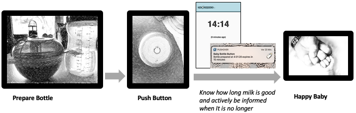
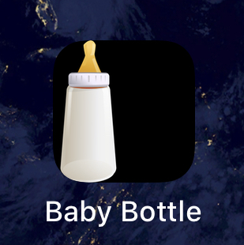
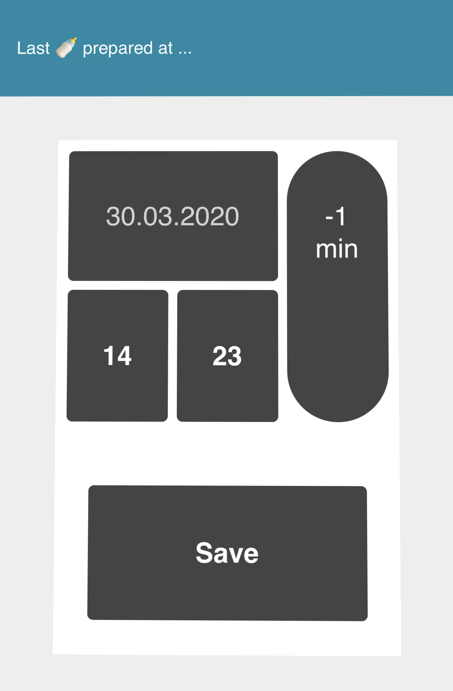
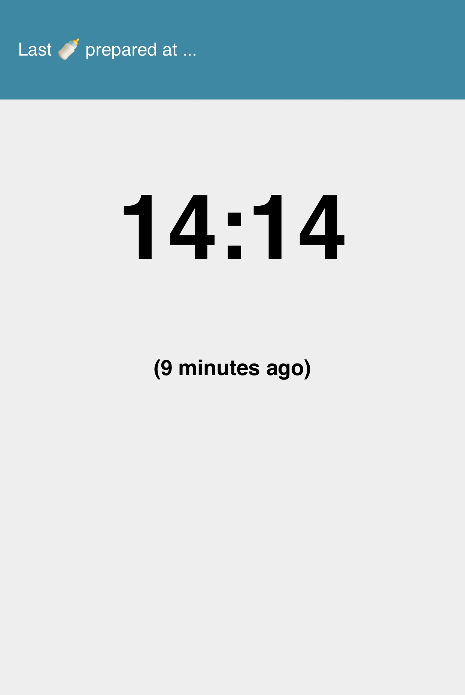
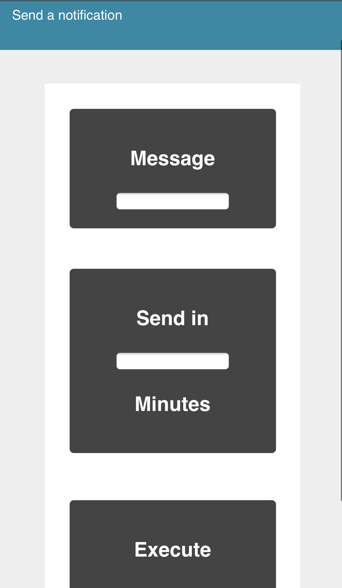
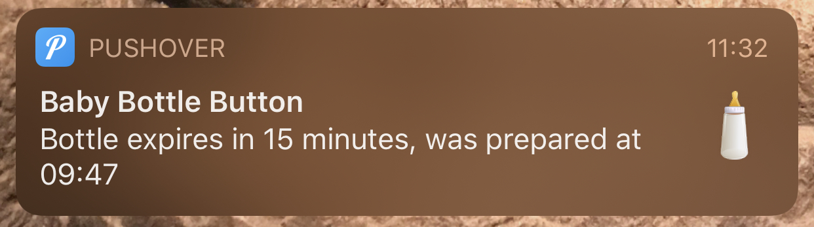

<link rel="stylesheet" href="https://cdnjs.cloudflare.com/ajax/libs/font-awesome/5.13.0/css/all.css" integrity="sha256-2SjB4U+w1reKQrhbbJOiQFARkAXA5CGoyk559PJeG58=" crossorigin="anonymous" />

# Universal Timer-based Notifier - UnTiBaNo

# What is it good for?
## A dedicated event-based workflow with a timer reminder involved
The scenario is as follows: You want to be informed after a given time after an event by receiving a message on your (mobile) devices. You also want to check on a webpage when the last event occured.
Using a physical button let you integrate the notification timer in your real workflows which is more natural and does not require grabbing a device and clicking on a phone or something. Especially in stressful situations or when there is not much time that procedure comes handy.

### Example: Baby Bottle Expiration Info
All parents with an infant that needs bottled milk most probably knows the question „when did you prepare that bottle in the bottle warmer?“ The reason is that milk should only be used for a maximum of two hours to prevent it from being bad. And the answer will be not that easy when baby cries for food at 3:30 a.m. and you try to remember when the bottle in the warming device was actually prepared ;-)
<br/><br/>


## A generic need to set a timer that sends a message and reminder after a specified time to your devices
The second option is to just enter a message and a timeout that will be sent to your devices. An example could be the moment when your laundry is ready. These notifications currently do not have a page to check the time remaining.

## A notification gateway
To send messages after a given time or triggering an event as described in the first use-case, UnTiBaNo can also be server as a Microservice to do so. You can utilise the API directly without using the UI.

# Requirements
## Software
* [Node.js](https://nodejs.org/)
  * SQLite
  * Express.js
  * Request
## Hardware (optional, but very useful)
- [MyStrom Wifi Button](https://mystrom.ch/wifi-button/) (or similar that can trigger a GET request to an endpoint)
## Service (essential for push notifications)
- PushOver (to receive push notifications on iOS and Android devices, currently about 5 Euros one-time payment). Information about their API and registration is available at [PushOver.net](https://pushover.net/)

# Installation
Download the content to a directory of choice. Run 
```
npm install
```
Now all dependencies should be installed and you can launch the system by executing
```
npm start
```
When started, the system will show the hostname and port in a link to the startpage, e.g.:
```shell
UnTiBaNo started and is listening on port 8088 check http://myDevSys:8088/
============================================================================================
```

## Autostart System on Windows Machines
Besides the option to use [Node-Windows](https://www.npmjs.com/package/node-windows) to run it as a service, the easiest way is to create a short-cut in Windows auto-start folder.
To do so open the _Run_ dialog by pressing  _<i class="fab fa-windows"></i> + R_, and execute:
```
shell:startup
```
There create a shortcut that targets the _Node_ executable similar to this:
```
"C:\Program Files (x86)\nodejs\npm.cmd" start 
```
and is executed in the folder you extracted the package to.

## Add as an App to the iPhone/iPad homescreen

To be easily started just as every other app on your phone or tablet, you may add a link to the home screen for the webpage. You can do this by clicking the share icon <i class="far fa-share-square"/></i> in Safari and then choose to _Add to Home Screen_. 
The icon that will be shown can be configured in your _config.json_, the name will be the title configured in the same file. 
An example for the Baby Bottle usecase is shown on the left.
<br/><br/>

## Wifi Button
Setup of the Wifi Button is easy and can be done without any registration at the vendors service. When started, it is in WPS mode and can be connected to your router that way. Connecting it via USB enables the maintenance mode (maybe longer button press is needed) and then you can set the service to be triggered by using the [MyStrom API](https://mystrom.com/mystrom-rest-api/) via curl like this:
```
curl --location --request POST 'http://BUTTON_IP/api/v1/action/single' --data-raw 'get://SERVER_IP_or_HOST:8088/event'
```
## PushOver Service
You can register for an account at [PushOver.net](https://pushover.net/) and test the service for 7 days. After registration you will get a user id and can setup an application for your specific workflow and one for your generic timer at PushOver that will be the target for your push notifications. The app will have a token to be included in your requests to their API as shown later in configuration. More options are found at the [PushOver API documentation](https://pushover.net/api)

# Configuration
The _config.json_ file is used to configure the system. It holds the configuration of messages, locale and the pushover account information.
```json
    {
	"notification" :                             // Notification related data
		{
			"app_token"   : "abcde123",        // PushOver App ID for your primary workflow
			"generic_app" : "fghij456",        // The App ID of the generic timer app 
			"user_id"     : "klmno789",        // Your PushOver.net user ID
			"timer"       : 6300000,           // Time in milliseconds after which it is sent
			"message"     : "Expires in 15 m." // Message (extended with time of the event)
		},	
	"db_name"   : "bottles",                     // SQLite database name of choice
	"db_file"   : "bottles.db",                  // Preferred name of the database file
	"header"    : "Last 🍼 prepared at ...",     // The header used in the webpages
	"locale"    : "de",                          // The locale used for rendering the times
	"title"     : "Baby Bottle",                 // The title for the webpages
	"app_icon"  : "img/bottle.png"               // Icon used when adding link to iOS homescreen
    }
```

# Usage
The root page of the server will present links to the next two pages __http://IP_or_HOST:8088/__


## __Save an event__
### _http://IP_or_HOST:8088/input_
Open the URL in a browser.
The UX philosophy is that you might often want to register the event just a few minutes afterwords. \
So it is optimised to scroll back in time fast with a _-1 minute_ button until the correct time of the event is shown. \
When saving, you are redirected to the monitor page below. \
<br><br>

## __Check for the last occurance__
### _http://IP_or_HOST:8088/monitor_
Open the URL in a browser to see when the last event was logged and how long it was ago.
<br><br><br><br><br><br>

## __Add a general timer notification__
### _http://IP_or_HOST:8088/notifier_
Open the URL in a browser and enter a message and time in minutes, when the notification should be sent.
<br><br><br><br><br><br><br><br>
## __Receive Push Notification__

<br/><br/>
When PushOver is configured, you will receive you push notification after the time configured in _config.json_ about the registered event of your main workflow or when the general timer you added is expired.

# API
## Register an event and prepare notification after configured time
### __GET__ _http://IP_or_HOST:8088/event_
When triggered without any further options, current time is used. When adding a GET parameter called _timestamp_ and a value in milliseconds, that is taken as the events time, e.g. __event?timestamp=1586770420146__
## Send a notification after given minutes with given message
### __POST__ _http://IP_or_HOST:8088/notification_
The data must be _x-www-form-urlencoded_ and contain __message__ and __minutes__ variables.
